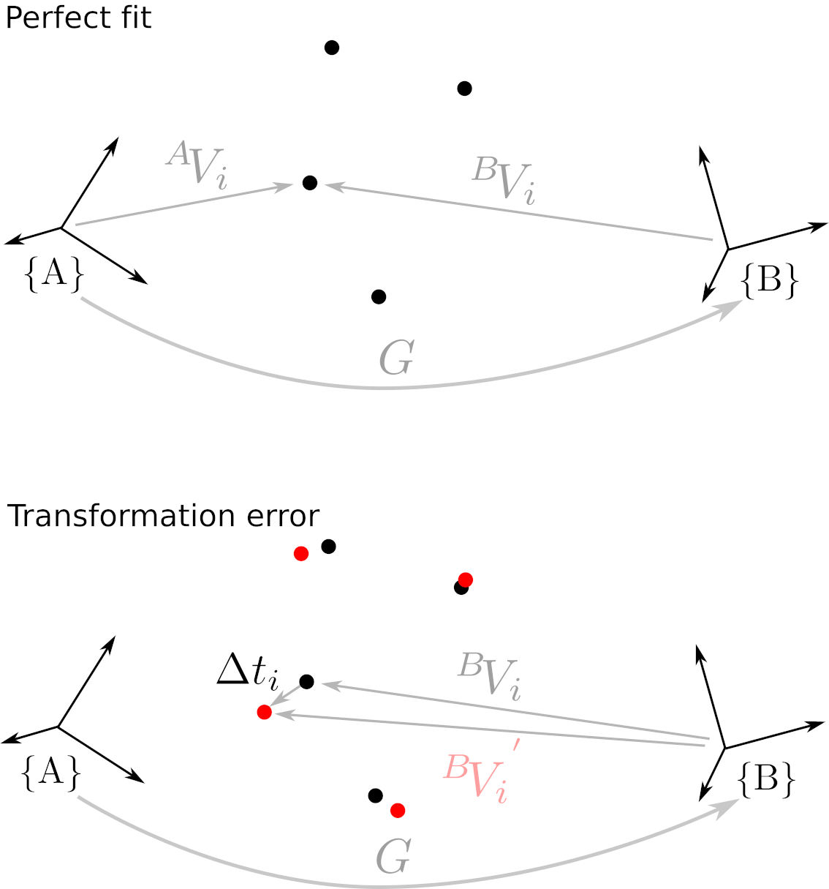

 

# PointSetsFitting

In this repository are implementations of the algorithm "Least-Squares Fitting of two 3d Point Sets" in Python and C++. This method can be used to compute the rigid transformation between two sets of corresponding 3D vectors. 

# Point sets and the rigid transformation

In regards to the image below, the 3D vectors in the first point set are defined in the coordinate system A. The corresponding 3D points in the second point set are defined in the coordinate system B. The resulting rigid transformation G connects those two coordinate systems A and B, such that 

where G is a 4x4 matrix and both vectors V are homogeneous coordinates of the form [x,y,z,1.0]'.

Often, the computed transformation G does not fit the two point sets perfectly. One reason for that can be noise during the point acquisitions. That results in a transformation error. In this implementation, the transformation error is the average of all the Euclidean distances between the transformed and actual point coordinate.
